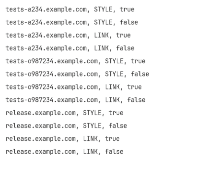

# Jaisocx Java Tools

## Combiner Tool

```
src/main/java/com/jaisocx/tools/combiner/Combiner.java
```


### Keywords
- Java
- Test
- Unit Tests
- Combiner
- Combinations


### Features

- Produces every combination of several sets of data
- Support for different data types
- Not-fixed amount of input arguments
- Less dangerous one-level loop, instead of multilevel included sub-loops


### Tasks Solved By Combiner

**Combiner** Java Class Improves JUnit tests cover level.

The Combiner produces the entire set
of every unique combination of data sets entries.


For instance, some Java Class Method accepts 3 ( three ) input args:

```Java
  public void sampleMethod (
      String domainName,
      LoadingHtmlElems loadingHtmlElem,
      boolean boolVal
  ) {
    // ...
  }
```


With a JUnit test, 
You want to cover 100% of test cases,
for every value possible for every input arg, 
for example, declared in data sets like these:

```Java
  String[] domainsNames = new String[] {
      "tests-a234.example.com",
      "tests-o987234.example.com",
      "release.example.com"
  };

  enum LoadingHtmlElems {
      STYLE,
      LINK;
  }

  Boolean[] booleanValues = new Boolean[] {
      true,
      false
  };

```


The Combiner produces the entire set of unique combinations 
of data sets entries,
like this:

```Java
    List<List<Object>> combinations = Combiner.combine (
        locDomainsNames,
        locLoadingHtmlElems,
        locBooleanValues
    );
```





### Example

```Java
    // src/main/java/com/jaisocx/tools/combiner/CombinerExample.java
    ...
    ...


    CombinerExample locInstance = new CombinerExample();
    
    List<String> locDomainsNames = Arrays.asList( locInstance.domainsNames );
    List<LoadingHtmlElems> locLoadingHtmlElems = Arrays.asList( LoadingHtmlElems.values() );
    
    //# Example declaration of a strings array
    // List<String> stringValues = Arrays.asList( "YES", "NO" );
    
    //# Example declaration of boolean values.
    List<Boolean> locBooleanValues = Arrays.asList( true, false );


    // Generate all combinations in one-level loop
    List<List<Object>> combinations = Combiner.combine (
        locDomainsNames,
        locLoadingHtmlElems,
        locBooleanValues
    );

    // use every combinations less dangerous in a one-level loop
    CombinerExample.printCombinations ( combinations );
}

public static void printCombinations (List<List<Object>> combinations) {
    combinations.forEach(combinationItem -> CombinerExample.printCombinationsItem( combinationItem ));
}

public static void printCombinationsItem (List<Object> combinationItem) {
    combinationItem.forEach(object -> System.out.print( object.toString() + " " ));
    System.out.println();
}
```


